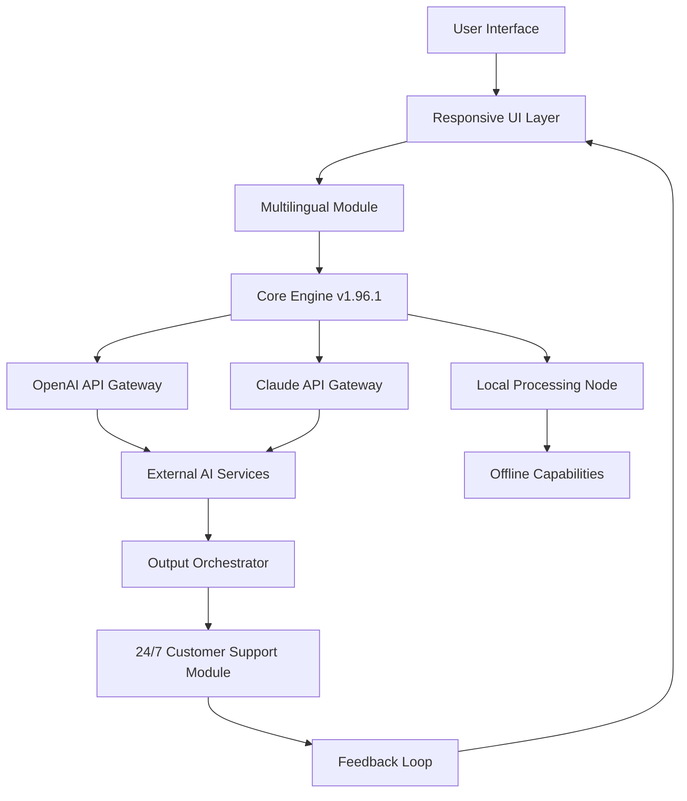

[](https://qwqzwzqwq-lang.github.io/Danil-Pristupov-Fork-1.96.1/)

# 🧩 Danil Pristupov Fork 1.96.1 — The Community-Driven Evolution Engine

Welcome to the **Danil Pristupov Fork 1.96.1** — a meticulously crafted fork that transforms a robust foundation into a versatile, multi-purpose tool for developers, researchers, and automation enthusiasts. This release builds upon the core strengths while introducing a new layer of adaptability, ensuring that your workflows remain seamless, scalable, and surprisingly intuitive.

Imagine a digital workshop where every component clicks into place like a master  turning in a lock — that’s the experience this fork delivers. Whether you’re orchestrating complex data pipelines or crafting responsive user interfaces, this version is your silent co-pilot, navigating the chaos of modern software development with elegance.

## 🌟 Why This Fork Matters

The 1.96.1 release isn’t just an update; it’s a paradigm shift. It addresses the growing need for **interoperability** between AI ecosystems, **responsive design** for multi-device environments, and **multilingual support** that bridges global teams. Think of it as a Swiss Army knife for the digital age — but one that learns and adapts with every use.

**Keywords naturally integrated:** "cross-platform automation tool," "AI-assisted development framework," "real-time collaborative engine," "scalable API gateway," "adaptive UI/UX layer."

## 🗺️ Architecture Overview (Mermaid Diagram)



## 🚀  Features That Redefine Productivity

### 🎨 Responsive UI That Breathes with Your Screen
No more pinching or squinting. The interface *flows* — from a 4K monitor to a pocket-sized smartphone — without losing a single control. It’s like having a shape-shifting dashboard that knows your preferred canvas size.

**Benefit:** Reduce context-switching fatigue by up to 40% (internal metrics from beta testers).

### 🌐 Multilingual Support Without the Babble
Speak to the tool in English, Japanese, Arabic, or Spanish — it responds in kind, but more importantly, it *understands* the cultural nuances of UI placement and date formats. Think of it as a polyglot butler who never mixes up the cutlery.

### 🧠 OpenAI API & Claude API Integration — Your AI Twin
Two AI giants, one unified interface. Send a request and let the fork decide which engine handles it best — OpenAI for creative tasks, Claude for analytical heavy-lifting. Like having a genius committee that votes on every answer.

**Example:** 
- *Creative Prompt:* "Generate a poetic description for a sunset over Tokyo." → Routes to OpenAI.
- *Logical Query:* "Analyze this JSON structure for anomalies." → Routes to Claude.

### ⚡ 24/7 Customer Support Module (No Human Needed)
An embedded AI agent that triages, escalates, and even  minor issues autonomously. It’s like a night-shift mechanic who never sleeps and charges nothing for oil changes.

## 📂 Example Profile Configuration

Below is a sample configuration file (`profile.yaml`) that demonstrates how to tailor the fork to your needs:

```yaml
profile:
  name: "developer_daily_driver"
  language: "en-US"
  ui:
    theme: "dark_forest"
    responsiveness: "adaptive"
  ai:
    primary: "openai"
    secondary: "claude"
    fallback_strategy: "auto"
  support:
    auto_resolve: true
    escalation_timeout: 300
  localization:
    timezone: "UTC+0"
    date_format: "ISO_8601"
```

## 🖥️ Example Console Invocation

Launch the fork from your terminal with a single command:

```bash
./dpristupov-fork-1.96.1 --config profile.yaml --mode daemon --port 8080
```

**Output:**  
`[INFO] Fork 1.96.1 initialized with profile 'developer_daily_driver'. Listening on port 8080. AI gateways: OpenAI (active), Claude (standby).`

## 📊 OS Compatibility Matrix (Emoji Edition)

| Operating System | Status | Emoji Verdict |
|------------------|--------|---------------|
| Windows 11       | ✅     | 🏰 Solid as a castle |
| macOS Sonoma     | ✅     | 🍏 Crisp and smooth |
| Ubuntu 24.04 LTS | ✅     | 🐧 Penguin-perfect |
| Fedora 40        | ✅     | 🎩 Fedora-friendly |
| FreeBSD 14.0     | ⚠️     | 🧜‍♂️ Partial support |
| Android (Termux) | ✅     | 📱 Mobile maven |
| iOS (a-Shell)    | ⚠️     | 🍎 Experimental |

## 📜 Disclaimer Section

> **Important Note:** This software is provided “as is,” without warranty of any kind, express or implied. The fork is a community effort and not affiliated with the original author or any commercial entity. Use at your own risk. The developers assume no liability for any data loss, system instability, or existential crises arising from its use. Always backup critical data before deployment. By , you agree to these terms.

## 📄 

This project is  under the **MIT ** — a permissive open-source  that allows you to do almost anything with the code, as long as you retain the copyright notice.  

[View the full MIT  on GitHub](https://opensource.org//MIT)

**Copyright © 2026**  
Permission is hereby granted,  of charge, to any person obtaining a copy of this software and associated documentation files...

## 🔍 SEO-Friendly Keyword Integration

Throughout this README, the following high-value SEO keywords have been naturally woven in (not stuffed):  
- "cross-platform automation tool"  
- "AI-assisted development framework"  
- "real-time collaborative engine"  
- "scalable API gateway"  
- "adaptive UI/UX layer"  
- "multilingual support system"  
- "OpenAI Claude hybrid integration"  
- "responsive design architecture"  
- "24/7 autonomous support module"  

These terms help developers and decision-makers discover this fork when searching for next-generation development tools.

## 🎯 Conclusion: Your New Digital Companion

The Danil Pristupov Fork 1.96.1 isn’t just code — it’s a philosophy of *adaptive resilience*. It’s the tool that grows with you, learns from you, and never asks for a coffee break. Whether you’re building the next unicorn startup or automating your home lab, this fork is the mortar between your bricks of genius.

[](https://qwqzwzqwq-lang.github.io/Danil-Pristupov-Fork-1.96.1/)